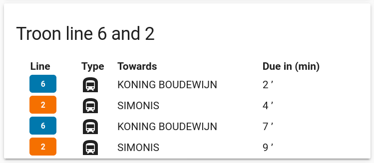
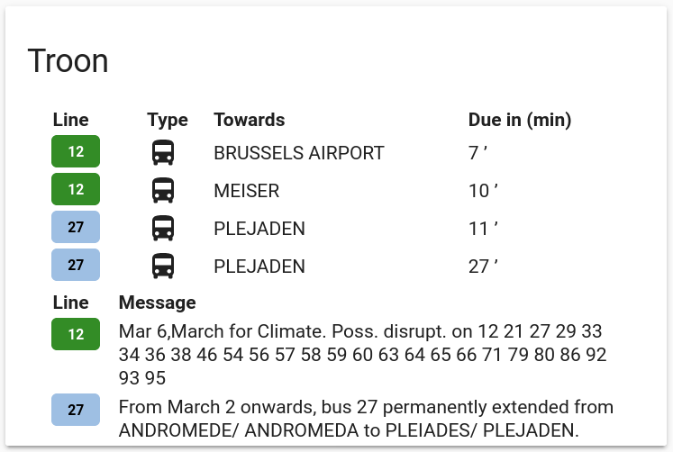
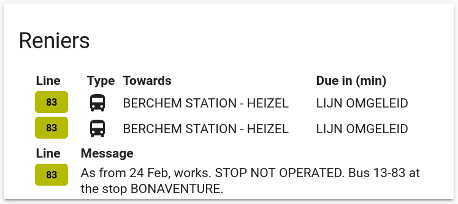

# Stib-Mivb

This card generates a passages card for the De Lijn public transport service in Flanders (Belgium).



## Options

| Name | Type | Requirement | Description
| ---- | ---- | ------- | -----------
| type | string | **Required** | `custom:stib-mivb-card`
| entity | string | **Required** | The entity_id of the entity you want to show.
| title | string | **Optional** | Add a custom title to the card.
| config_type | string | **Optional** | 'default' for standard setup, 'raw' for raw entity data, 'columns' for defining a custom list of columns. If this option is not added the default setup will be shown in the card.
| columns | object | **Optional** | List of columns to display.

## Column object

| Name | Type | Requirement | Description
| ---- | ---- | ------- | -----------
| title | string | **Required** | Column header to display.
| field | string | **Required** | key value of the entity that you wish to display.

## Installation

### Step 1

Install `stib-mivb-card` by copying `stib-mivb-card.js` from this repo to `<config directory>/www/stib-mivb-card.js` of your Home Assistant instance.

**Example:**

```bash
wget https://raw.githubusercontent.com/Emilv2/stib-mivb-card/master/stib-mivb-card.js
mv stib-mivb-card.js ~/.homeassistant/www/
```

### Step 2

Set up the De Lijn custom sensor.

**Example:**

```yaml
sensor:
  - platform: stib_mivb   
    api_key: ed3d8637ab9d3397a50a801957cb17ca
    lang: nl
    message_lang: en
    stops:
      - stop_id: 8301
        line_numbers: 
          - 6
          - 2
```
**_Note_**: replace the `api_key` with the access token you generated with you opendata.stib-mivb.be developer account.

### Step 3

Link `stib-mivb-card` inside you `ui-lovelace.yaml` or via the `Raw config editor` when using the `Configure UI` in the Home-Assistant interface directly.

```yaml
resources:
  - url: /local/stib-mivb-card.js
    type: js
```

### Step 4

Add a custom element in your `ui-lovelace.yaml`. Or when using the `Configure UI` in the Home-Assistant interface directly you can add a `Manual Card` with this in the Card Configuration.

**Example:**

Example with default layout in the `ui-lovelace.yaml`:
```yaml
      - type: 'custom:stib-mivb-card'
        entity: sensor.troon_line_6_2
        title: 'Troon'

```
Same when going via the `Configure UI`:
```yaml
entity: sensor.troon_line_6_2
title: 'Troon'
type: 'custom:stib-mivb-card'


```
Example of a line with messages:


Example of a deviated line:


## Credits

Thanks to [cgtobi's rmv-card](https://github.com/cgtobi/rmv-card), [Ian Richardson's list-card](https://github.com/custom-cards/list-card), [bollewolle's delijn-card](https://github.com/bollewolle/delijn-card), and [Helldog136's stib-mvib-card](https://github.com/helldog136/stib-mvib-card) for all the initial work and inspiration.
